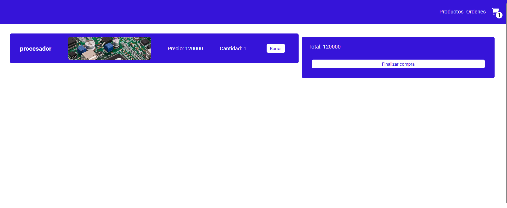

# E-Commerce App - React Native

Una aplicación web de comercio electrónico desarrollada con React que ofrece una experiencia de compra completa y fácil de usar.

## Funcionalidades Principales


### Pantalla de Productos

- Lista todos los productos en tarjetas con nombre y foto.
- Incluye un buscador para filtrar productos por nombre.
- Al hacer clic en un producto, se navega a la pantalla de detalles del producto.

### Pantalla de Detalles del Producto

- Proporciona una descripción detallada del producto.
- Muestra el precio y el stock disponible.
- Permite agregar el producto al carrito.

### Pantalla de Carrito
- Proporciona una descripción detallada de los producto.
- Muestra el precio y la cantidad por producto.
- Muestra Precio Total



### Navegación

```javascript
        function App() {

            return (
              <div className="App">
                <BrowserRouter>
                <ProductsProvider>
                  <CartProvider>
                    <Navbar/>
                      <Routes>
                        <Route path='/' element={<ItemListContainer/>}/>
                        <Route path='/detail/:id' element={<ItemDetailContainer/>}/>
                        <Route path='/cart' element={<ItemCartContainer/>}/>
                        <Route path='/orders' element={<OrderContainer/>}/>
                        <Route path='/checkout' element={<CheckoutContainer/>}/>
                      </Routes>
                    </CartProvider>
                  </ProductsProvider>
                </BrowserRouter>
              </div>
            )
    }


```

- **Link 1 - Productos:** Categorías y productos (stack principal).
- **Link 2 - Órdenes:** Historial de órdenes realizadas.
- **Link 2 - Carrito:** Detalles del carrito de compras con resumen y botón para finalizar la orden.


## Tecnologías Utilizadas


- **React Router DOM:** Gestiona la navegación entre pantallas.
- **React:** Framework para contruccion de interfaces
- **Firebase:** Realiza operaciones de lectura/escritura en la base de datos.

## Instalación

1. Clona el repositorio: `git clone https://github.com/tu-usuario/tu-aplicacion.git`
2. Instala las dependencias: `npm install`
3. Configura las claves de API para servicios externos (Firebase, etc.).
4. Configura las credenciales de Firebase en tu proyecto.
5. Ejecuta la aplicación: `npm start`

## Contacto

Para preguntas o soporte, contacta a maxi_rosanda@hotmail.com.